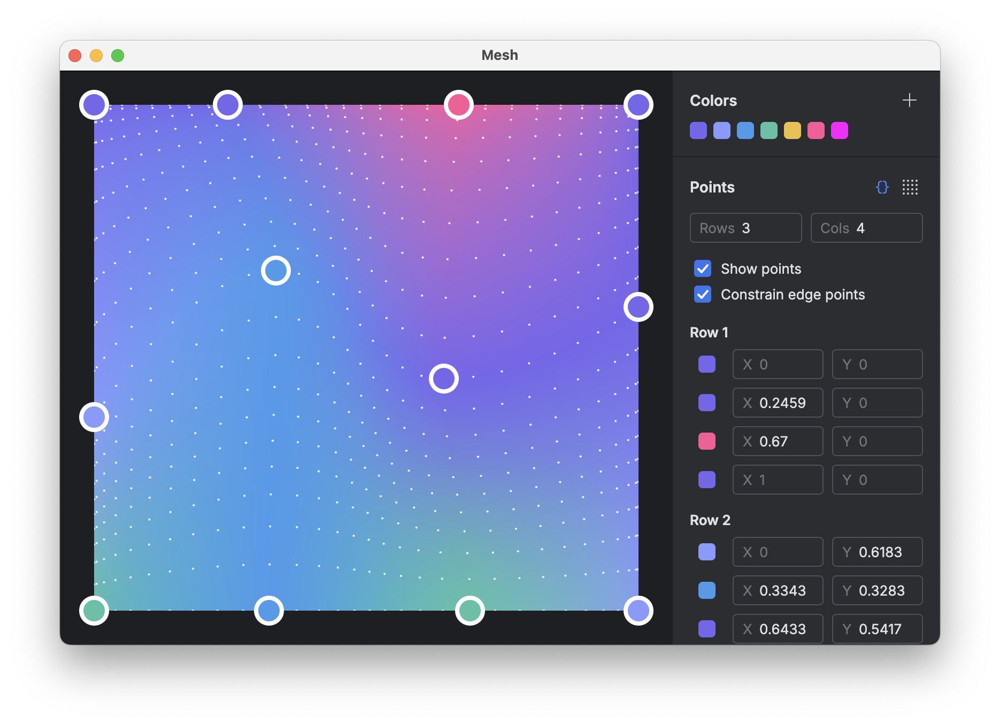

# Mesh

A simple tool to create and edit mesh gradients. Mesh gradients are drawn with the wonderful [implementation](https://gist.github.com/sinasamaki/05725557c945c5329fdba4a3494aaecb?ref=sinasamaki.com) by [@sinasamaki](https://www.sinasamaki.com/mesh-gradients-in-jetpack-compose/)

Built as a [Compose Desktop](https://www.jetbrains.com/compose-multiplatform/) app, with the JetBrains [Jewel UI standalone toolkit](https://github.com/JetBrains/jewel).

🔮 This README was mostly generated with Cursor.

## Features

### Current

- Create smooth mesh gradients with customizable control points
- Adjustable grid dimensions (2-10 rows/columns) 
- Color palette management
- Precise control point positioning
- Edge point constraints
- Interactive gradient preview
- Dark theme UI using Jewel components

### Future

- [x] Export code for gradient
- [x] Export gradient as image
- [x] Ability to change canvas size and background color
- [ ] Allow changing resolution of gradient
- [ ] Save/load gradient configurations
- [ ] Multiple gradient presets
- [ ] Gradient animating fun
- [ ] Undo/redo functionality

## Stack

- **Kotlin** - Primary programming language
- **Compose Multiplatform** - UI framework for desktop
- **Jewel UI (standalone)** - JetBrains design system components
- **Kotlinpoet** - Code generation for gradient export

## Getting Started

### Building and Running

1. Clone the repository
2. Run the desktop application:

```bash
./gradlew :composeApp:run
```

Or use the provided run configuration in `.run/desktopApp.run.xml`

## Usage

### Basic Controls

- **Double-click** the canvas to toggle control points visibility
- **Drag control points** to adjust gradient mesh
- **Add colors** using the color picker in the side panel
- **Adjust grid** using the Rows/Cols inputs
- **Toggle constraints** to lock edge points
- **Export points** points as a list of `Pair<Offset, Color>` objects to use in [@sinasamaki](https://gist.github.com/sinasamaki/05725557c945c5329fdba4a3494aaecb?ref=sinasamaki.com)'s Modifier recipe
- **Export as an image** at 1x, 2x, or 3x scale

### Color Management

Colors can be added to the palette using hex values. The application supports:
- Adding new colors
- Removing colors (minimum 1 color required)
- Selecting colors for control points via dropdown

## Project Structure

The project follows a basic Compose Multiplatform structure, generated from the [Kotlin Multiplatform wizard](https://kmp.jetbrains.com/) from JetBrains:

```
composeApp/
  ├── src/
  │   ├── commonMain/      # Shared code
  │   │   └── kotlin/
  │   └── desktopMain/     # Desktop-specific code
  │       └── kotlin/
  └── build.gradle.kts     # Desktop module configuration
```

## License

[Apache 2.0](LICENSE)
